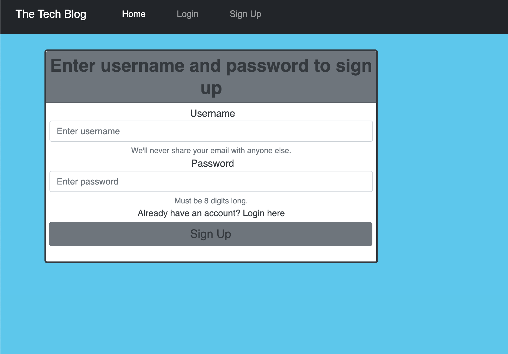

## Tech Blog CMS

This is a CMS-style blog site designed specifically for developers who want to publish articles, blog posts, and share their thoughts and opinions on various tech topics. With this platform, you can easily create, manage, and publish content, allowing you to focus on writing and sharing your knowledge with the tech community.

## Features

1. User Authentication: The site provides secure user authentication, allowing you to register an account and log in to manage your content.

2. Categorization and Tagging: You can assign categories and tags to your articles to organize and classify them based on topics or themes. This helps readers navigate your content more effectively.

3. Commenting System: The platform includes a commenting system that enables readers to engage with your articles. Users can leave comments, ask questions, and start discussions, fostering a sense of community around your blog.

4. Search Functionality: The site incorporates a search feature that allows users to search for specific articles or topics of interest. This helps readers find relevant content quickly.

5. Responsive Design: The blog site is built with a responsive design, ensuring that it adapts to different screen sizes and devices. This provides an optimal reading experience across desktop, tablet, and mobile devices.

## Technologies Used

. Front-end: HTML, CSS, JavaScript.

. Back-end: Node.js, Express.

. Database: MySQL.

. User Authentication: Implement a secure authentication system using techniques like password hashing, session management, and JWT (JSON Web Tokens).

. Deployment: Deploy your application to a hosting service like Heroku, AWS, or Azure, ensuring it is accessible to users over the internet.

## Getting Started

To get started with the Tech Blog CMS, follow these steps:

1. Clone the repository: git clonegit@github.com:tegaomare/tech-blog.git

2. Install the necessary dependencies: npm i

3. Set up your database and configure the connection details in the appropriate configuration file.

4. Run the development server: npm start

5. Access the blog site in your browser: http://localhost:3000

## Contribution

Contributions are welcome! If you have any ideas, suggestions, or bug fixes, please submit a pull request. Ensure that your code adheres to the project's coding guidelines and passes all tests before submitting.

## License

This project is licensed under the MIT License.

## Credits

https://github.com/branchwag/blogpage

Columbia University Coding Bootcamp

## App link

https://cbctech-blog-3328d1c29db1.herokuapp.com/

Happy blogging!
